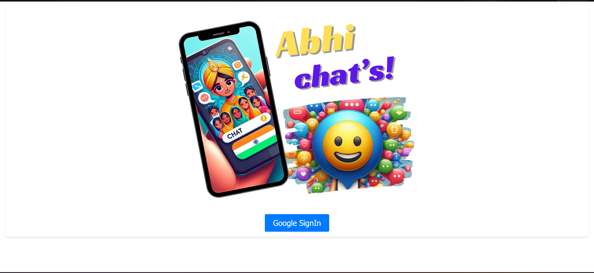

# React-Based Chat Room

## Description
This project is a real-time chat application built using React. It allows users to log in using their Google accounts and join chat rooms to communicate with other logged-in users.

## Features
- **Google Authentication:** Users can log in securely using their Google accounts.
- **Real-Time Chat:** Seamless real-time messaging experience for instant communication.
- **Multiple Chat Rooms:** Users can join different chat rooms based on their interests or needs.
- **Responsive Design:** Ensures usability across various devices and screen sizes.

## Technologies Used
- **Frontend:** React, React Hooks, Redux (optional for state management), Material-UI (for UI components)

